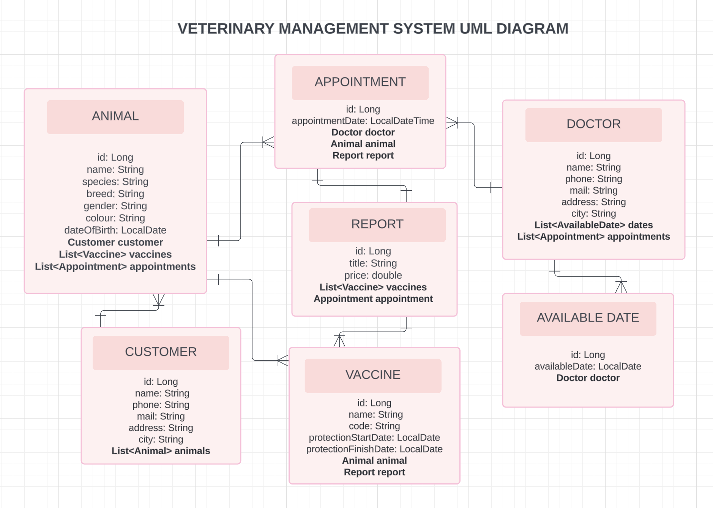

# Veteriner Yönetim Sistemi

Bir veteriner kliniğinin kendi işlerini yönetebildiği bir Rest API projesidir.

BackEnd link: https://github.com/nihangonenc/VetApp
Proje Canlı link: https://celebrated-gelato-27ee09.netlify.app/

## Kullanılan Teknolojiler

HTML, CSS, React.js, Visual Studio Code, Java, Spring Boot, PostgreSQL, Swagger, Docker, IntelliJ IDE

